# Data Communication and Security

## Answer Key and Exam-Ready Notes

These answers are structured for **8--10 mark responses**: definition,
principle/working, diagram or table, examples, advantages/limitations,
and a conclusion where appropriate. Diagrams are written in Mermaid or
ASCII so they render on GitHub. Numerical solutions show the formula and
steps.

> **Important source limitations:** The supplied question bank omits the
> generator polynomial for both CRC problems, and one checksum exercise
> calls 9-bit strings "8-bit" words. Those cannot be solved uniquely
> without assumptions. Where an assumption is necessary, it is stated
> rather than quietly pretending the question is complete.

------------------------------------------------------------------------

# Unit 1: Introduction and Physical Layer

## Q1. Types of computer networks

A **computer network** is a collection of interconnected devices that
exchange data and share resources through communication links and agreed
protocols. Networks are commonly classified by geographical coverage and
purpose.

  -----------------------------------------------------------------------
  Type                    Coverage /              Example and use
                          characteristics         
  ----------------------- ----------------------- -----------------------
  PAN (Personal Area      A few metres around a   Bluetooth between
  Network)                person                  phone, watch, and
                                                  earbuds

  LAN (Local Area         Room, office, building, Computers and printers
  Network)                or campus segment;      in a college lab
                          usually privately       
                          managed                 

  WLAN                    LAN implemented         Home or campus Wi-Fi
                          wirelessly, generally   
                          using Wi-Fi             

  CAN (Campus Area        Connects multiple LANs  University buildings
  Network)                across a campus or      connected by fibre
                          institution             

  MAN (Metropolitan Area  City or metropolitan    City-wide network
  Network)                region                  connecting offices

  WAN (Wide Area Network) Large geographical      A bank connecting
                          area, often using       branches across
                          carrier infrastructure  countries; the Internet
                                                  is the largest example
  -----------------------------------------------------------------------

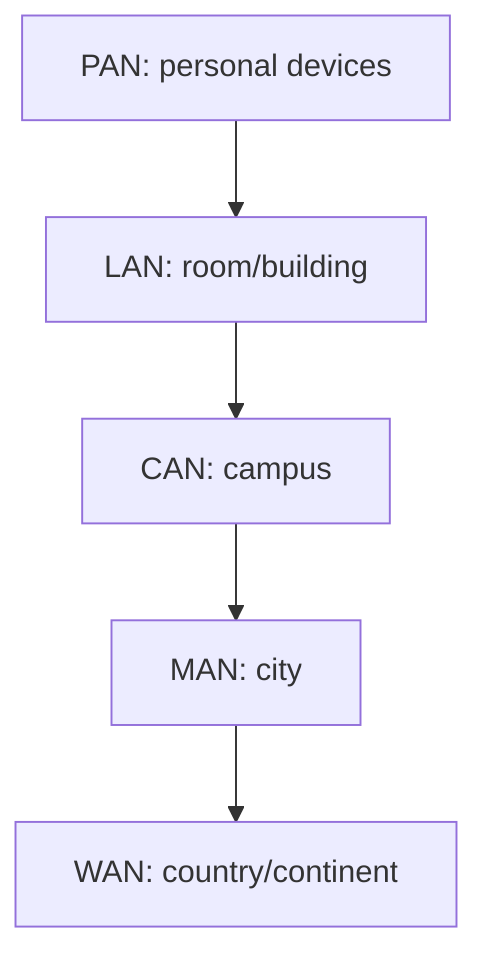

**Other classifications:** client-server networks use dedicated servers
to provide services; peer-to-peer networks allow devices to share
resources directly. A network can also be wired or wireless, private or
public, and centralized or distributed.

**Advantages:** resource sharing, communication, centralized management,
remote access, collaboration, and scalable services. **Limitations:**
security risks, setup and maintenance costs, dependency on network
availability, congestion, and potential privacy issues.

**Conclusion:** The choice depends on required coverage, cost,
performance, ownership, security, and number of users. PAN suits
personal devices; LAN suits buildings; WAN suits geographically
dispersed organizations.

## Q2. Network topologies

**Network topology** describes how devices and links are arranged,
physically or logically.

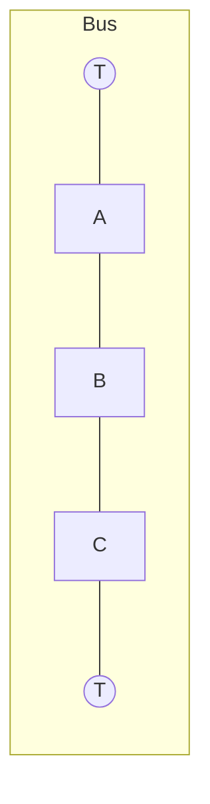

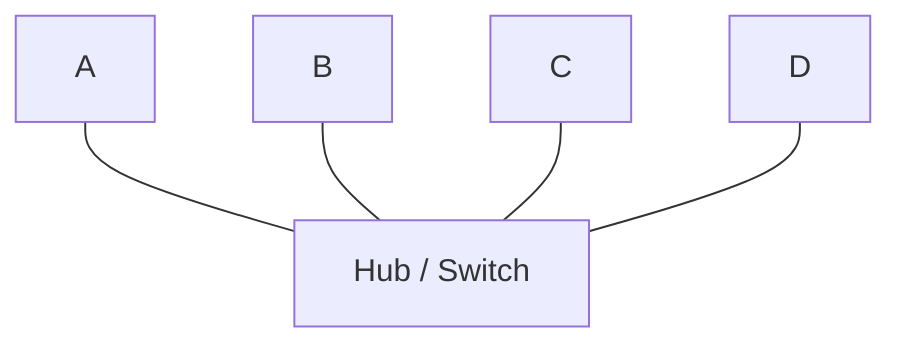

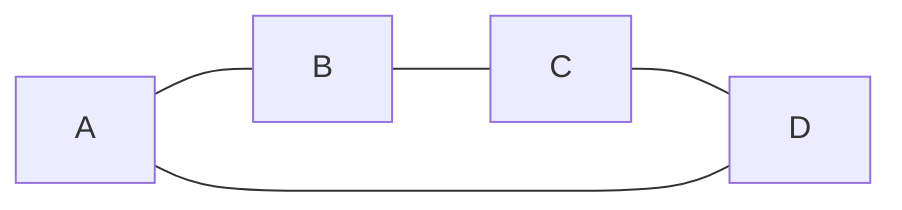

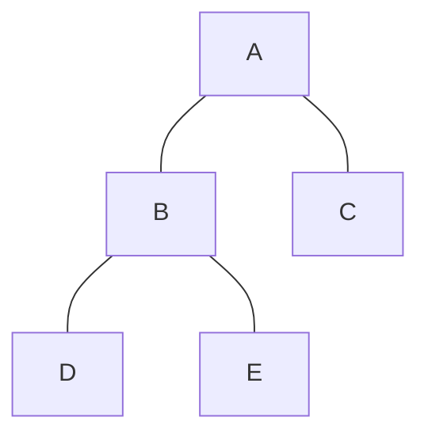

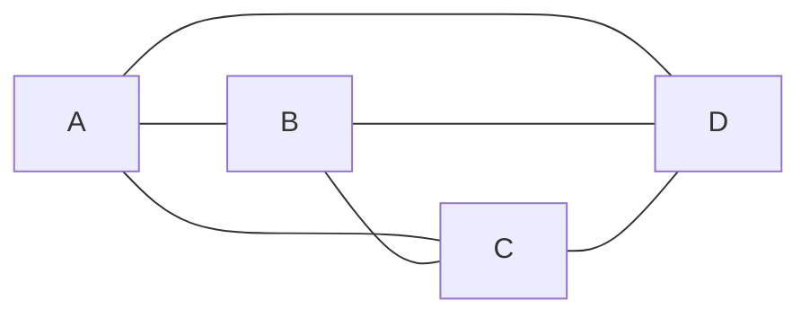

  ------------------------------------------------------------------------
  Topology          Description        Advantages        Disadvantages /
                                                         use
  ----------------- ------------------ ----------------- -----------------
  Bus               All nodes share a  Low cost, little  Backbone failure
                    backbone cable     cable             affects all;
                                                         collisions; small
                                                         legacy networks

  Star              Every node         Easy to add,      Central device is
                    connects to a      isolate, and      a single point of
                    central hub/switch troubleshoot      failure; common
                                       nodes             in Ethernet LANs

  Ring              Each node connects Orderly access    Link/node failure
                    to two neighbours  possible          can disrupt ring
                                                         unless protection
                                                         exists; some
                                                         industrial
                                                         networks

  Tree              Hierarchical       Scalable and easy Upper-level
                    star-like          to segment        failure affects
                    arrangement                          branches; campus
                                                         networks

  Mesh              Nodes have         High redundancy   Expensive and
                    multiple           and fault         complex;
                    interconnections   tolerance         WAN/backbone and
                                                         wireless mesh

  Hybrid            Combination of     Flexible and      Design and
                    topologies         adaptable         management
                                                         complexity
  ------------------------------------------------------------------------

**Physical topology** describes actual cabling and devices; **logical
topology** describes how data flows. For example, switched Ethernet is
physically star-shaped but each switch port is a separate link.

## Q3. Overview, components, advantages, and applications

A network transfers information from a source to a destination through a
communication medium using protocols.

**Basic components** 1. **Sender/source:** generates data, e.g. a
laptop. 2. **Receiver/destination:** accepts data, e.g. a server. 3.
**Message:** data being communicated, such as text, audio, video, or
files. 4. **Transmission medium:** copper, fibre, or radio. 5. **Network
devices:** switches connect LAN devices; routers forward packets between
networks; access points connect wireless devices; modems adapt signals
to a transmission service. 6. **Protocols:** rules for addressing,
formatting, timing, error handling, and delivery, e.g. Ethernet, IP,
TCP, and HTTP. 7. **Network interface:** hardware/software that connects
a device to a network.

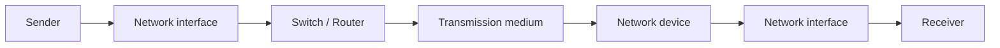

**Advantages:** sharing files, printers and Internet access; fast
communication; centralized backup and administration; distributed
processing; remote collaboration; and scalability.

**Applications:** web browsing, email, video conferencing, online
learning, banking, cloud computing, e-commerce, industrial monitoring,
healthcare systems, and IoT.

**Challenges:** security attacks, privacy risks, congestion, downtime,
cost, and the need for skilled administration. A good network design
balances performance, availability, security, and cost.

## Q4. OSI seven-layer reference model

The **OSI model** is a seven-layer conceptual framework that
standardizes the functions involved in network communication. Each layer
serves the layer above it and uses the layer below it.

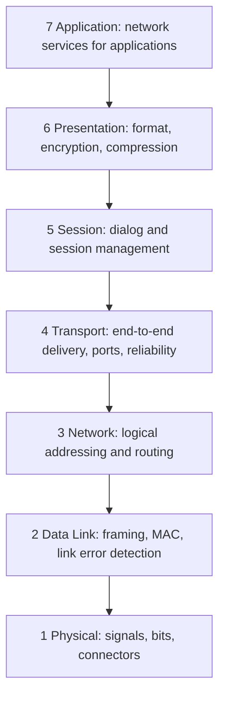

  -----------------------------------------------------------------------
  Layer                   Main responsibilities   Examples
  ----------------------- ----------------------- -----------------------
  7 Application           Services directly used  HTTP, SMTP, DNS
                          by applications         (protocols commonly
                                                  mapped here)

  6 Presentation          Data representation,    Character encoding,
                          translation,            data serialization,
                          encryption, compression encryption functions

  5 Session               Establishes, manages,   Session/dialog
                          and terminates dialogs; management
                          checkpoints             

  4 Transport             Process-to-process      TCP, UDP
                          delivery, segmentation, 
                          reliability, flow       
                          control, port numbers   

  3 Network               Logical addressing,     IP, routers
                          routing, packet         
                          forwarding              

  2 Data Link             Framing, MAC            Ethernet, Wi-Fi MAC,
                          addressing, media       switches
                          access, link-level      
                          error detection         

  1 Physical              Transmission of raw     Cables, connectors,
                          bits as electrical,     radio frequencies
                          optical, or radio       
                          signals                 
  -----------------------------------------------------------------------

**Encapsulation:** As data moves down the stack, each layer adds control
information. The receiver removes the corresponding headers while moving
upward.

``` text
Application data
      ↓ Transport adds header
[Transport header | Data]                         Segment
      ↓ Network adds header
[Network header | Transport header | Data]       Packet
      ↓ Data Link adds header/trailer
[Frame header | Packet | FCS]                    Frame
      ↓ Physical encodes as signals
010101...                                         Bits
```

**Why useful:** It separates responsibilities, simplifies
troubleshooting, supports interoperable design, and allows one layer to
evolve without redesigning every other layer. The OSI model is primarily
a reference model, not a claim that every real protocol implements seven
distinct modules.

## Q5. TCP/IP four-layer model

The TCP/IP model describes the architecture used by the Internet. A
common four-layer form is:

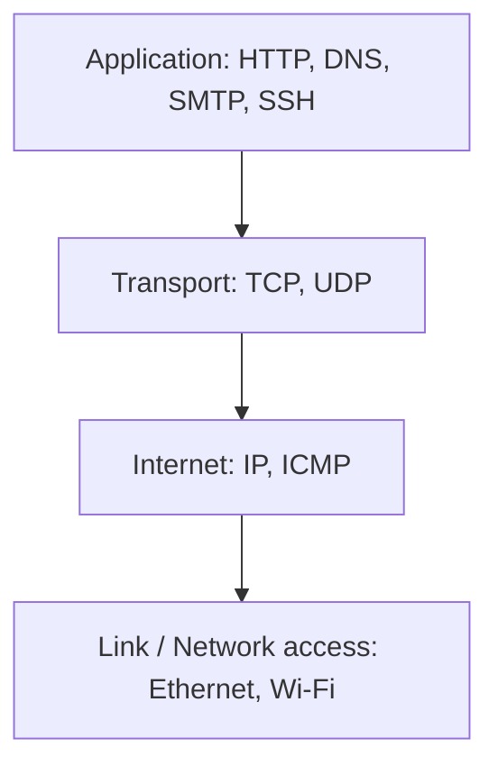

  -----------------------------------------------------------------------
  Layer                   Function                Examples
  ----------------------- ----------------------- -----------------------
  Application             Application protocols   HTTP/HTTPS, DNS, SMTP,
                          and data representation SSH

  Transport               Process-to-process      TCP, UDP
                          communication, ports,   
                          segmentation;           
                          reliability with TCP    

  Internet                Logical addressing and  IPv4, IPv6, ICMP
                          routing across          
                          interconnected networks 

  Link / Network access   Local-link delivery,    Ethernet, Wi-Fi,
                          framing, media access,  fibre/copper interfaces
                          physical transmission   
  -----------------------------------------------------------------------

**Encapsulation example:** An HTTP request is carried in a TCP segment,
inside an IP packet, inside an Ethernet or Wi-Fi frame, and then
transmitted as signals.

The model is practical and protocol-oriented. TCP offers ordered,
reliable byte-stream delivery; UDP offers datagrams with lower protocol
overhead but no built-in delivery guarantee. IP provides best-effort
packet delivery and routers forward packets toward their destinations.

## Q6. OSI vs TCP/IP

  -----------------------------------------------------------------------
  Basis                   OSI                     TCP/IP
  ----------------------- ----------------------- -----------------------
  Origin / purpose        ISO reference model     Internet protocol
                                                  architecture

  Layers                  Seven                   Usually four; some
                                                  texts show five by
                                                  splitting the link
                                                  layer

  Upper layers            Application,            Combined into
                          Presentation, Session   Application
                          are separate            

  Lower layers            Data Link and Physical  Combined as Link /
                          are separate            Network access in the
                                                  four-layer model

  Network layer service   Model permits different IP is connectionless
                          service concepts        and best-effort

  Transport               Transport layer defined TCP and UDP are widely
                          conceptually            used protocols

  Usage                   Teaching, design,       Actual Internet
                          troubleshooting         protocol suite
                          vocabulary              

  Protocol dependence     Model is                Built around the TCP/IP
                          protocol-neutral        suite
  -----------------------------------------------------------------------

**Mapping**

``` text
OSI                         TCP/IP
Application  ┐
Presentation ├────────────► Application
Session      ┘
Transport    ─────────────► Transport
Network      ─────────────► Internet
Data Link    ┐
Physical     ┴────────────► Link / Network access
```

**Similarity:** both use layered architecture, encapsulation, and
separation of communication functions. **Difference:** OSI distinguishes
seven conceptual layers, while TCP/IP combines several of them and is
built around operational Internet protocols. Neither is "better" in
every context: OSI is useful for learning and troubleshooting; TCP/IP
describes the deployed Internet.

## Q7. Guided transmission media

**Guided media** carry signals along a physical path.

### 1. Twisted-pair cable

Two insulated copper wires are twisted together to reduce
electromagnetic interference and crosstalk. Types include UTP and STP.

-   **Advantages:** inexpensive, flexible, easy to install; common for
    Ethernet and telephone wiring.
-   **Disadvantages:** limited distance and bandwidth compared with
    fibre; susceptible to interference, especially UTP.
-   **Applications:** office LANs, telephone lines, DSL.

### 2. Coaxial cable

A central conductor is surrounded by insulation, a metallic shield, and
an outer jacket.

-   **Advantages:** better shielding than basic twisted pair; useful
    bandwidth and durability.
-   **Disadvantages:** bulkier; connectors and installation can be less
    convenient than twisted pair.
-   **Applications:** cable TV, broadband access, RF systems.

### 3. Optical fibre

Carries light through a glass or plastic core using total internal
reflection. Single-mode fibre supports long distances; multimode fibre
is common for shorter links.

-   **Advantages:** very high capacity, low attenuation, long distances,
    immunity to electromagnetic interference, difficult to tap without
    detection.
-   **Disadvantages:** optical equipment and splicing can cost more;
    fibre can be physically fragile and requires care.
-   **Applications:** Internet backbones, data centres, FTTH, submarine
    cables.

  Feature                 Twisted pair    Coaxial          Optical fibre
  ----------------------- --------------- ---------------- ------------------------
  Signal                  Electrical      Electrical       Light
  Interference immunity   Low--moderate   Moderate--high   Very high
  Capacity / distance     Moderate        Moderate--high   Very high
  Cost / handling         Low/easy        Moderate         Higher skill/equipment

**Conclusion:** Copper is economical for short links; fibre is preferred
for high-capacity, long-distance backbones.

## Q8. Unguided transmission media

**Unguided media** transmit electromagnetic waves through air, vacuum,
or space without a dedicated cable. Antennas transmit and receive the
signals.

### Radio waves

Often omnidirectional and can penetrate some obstacles. Used in
broadcasting, Wi-Fi, Bluetooth, and mobile networks. Coverage is
convenient, but interference, spectrum sharing, and security are
concerns.

### Microwaves

Generally higher-frequency, often directional, and commonly require line
of sight. Used in point-to-point links, cellular backhaul, and satellite
communication. They can offer high capacity, but obstacles and weather
can affect some bands.

### Infrared

Short-range, often line-of-sight, and does not normally pass through
walls. Used in remote controls and some short-range device links. It has
limited range and can be blocked by objects.

### Satellite communication

A satellite relays signals between earth stations or user terminals. It
supports wide-area broadcasting, remote connectivity, navigation-related
systems, and maritime/aviation links. Limitations can include latency,
cost, weather effects in some bands, and limited capacity.

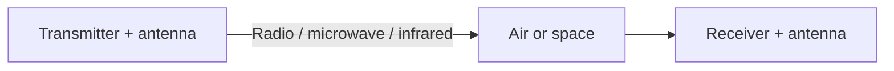

**Advantages:** mobility, rapid deployment, broadcast capability, and
connectivity where cabling is difficult. **Disadvantages:**
interference, attenuation, obstruction, spectrum regulation, and greater
exposure to interception unless protected by encryption and
authentication.

## Q9. Guided vs unguided media

  -----------------------------------------------------------------------
  Basis                   Guided                  Unguided
  ----------------------- ----------------------- -----------------------
  Path                    Physical cable or fibre Air, vacuum, or space

  Examples                Twisted pair, coaxial,  Radio, microwave,
                          fibre                   infrared, satellite

  Mobility                Usually limited by      Supports mobility and
                          cable                   wireless access

  Interference            Fibre is highly immune; More exposed to
                          copper varies           interference and fading

  Installation            Requires cable routes   May need antennas and
                          and physical access     spectrum planning

  Security                Physical access is      Signals may be received
                          often required to tap,  within coverage;
                          though not guaranteed   encryption is important
                          secure                  

  Capacity                Fibre offers            Depends on spectrum,
                          exceptionally high      band, channel
                          capacity                conditions, and
                                                  technology

  Best fit                Fixed LANs and          Mobile devices,
                          high-capacity backbones broadcast, remote links
  -----------------------------------------------------------------------

**Summary:** choose guided media for controlled, reliable fixed
connections; choose unguided media for mobility, broad coverage, and
flexible deployment. Real networks often combine both.

## Q10. Analog and digital communication

**Analog communication** represents information using a continuously
varying signal. **Digital communication** represents information as
discrete symbols, commonly bits encoded into signal states.

``` text
Analog:   smooth continuous waveform
Digital:  __|‾‾|__|‾‾‾‾|__|‾‾|__
```

  -----------------------------------------------------------------------
  Aspect                  Analog                  Digital
  ----------------------- ----------------------- -----------------------
  Signal values           Continuous              Discrete symbols

  Noise effect            Noise accumulates and   Regeneration can
                          directly distorts the   recover bits if errors
                          signal                  remain within limits

  Processing              Often harder to         Convenient for
                          store/process precisely computing, storage,
                                                  encryption, compression

  Error control           More limited in         Detection/correction
                          traditional systems     codes can be applied

  Bandwidth               Depends on modulation   Depends on coding,
                          and signal              modulation, rate, and
                                                  channel

  Examples                Traditional AM/FM       Ethernet, digital
                          radio, analogue audio   mobile networks,
                                                  streaming data
  -----------------------------------------------------------------------

**Analog advantages:** naturally represents many physical quantities;
can be simple for some systems. **Limitations:** distortion and noise
accumulate; copying and processing may degrade quality.

**Digital advantages:** reliable regeneration, encryption, compression,
error-control coding, and integration with computers. **Limitations:**
quantization is needed for analogue sources; synchronization and
conversion are required; a digital link still has noise and finite
capacity.

**Conclusion:** modern systems often digitize information and transmit
it using digital modulation, but the physical waveform remains an
analogue electromagnetic signal.

## Q11. Shannon's Capacity Theorem

Shannon's theorem gives the theoretical maximum information rate of a
band-limited channel with additive white Gaussian noise:

\[ C = B`\log`{=tex}\_2(1+S/N) \]

where (C) is capacity in bits/s, (B) is bandwidth in hertz, and (S/N) is
the **linear** signal-to-noise power ratio.

SNR in decibels is converted by:

\[
`\mathrm{SNR}`{=tex}*{dB}=10`\log`{=tex}*{10}(S/N),`\quad `{=tex}S/N=10\^{`\mathrm{SNR}`{=tex}\_{dB}/10}
\]

**Meaning:** capacity increases linearly with bandwidth and
logarithmically with SNR. Increasing signal power gives diminishing
returns, while adding bandwidth can increase capacity substantially,
subject to system constraints.

**Design impact** - Helps estimate the upper limit of a communication
channel. - Guides bandwidth, transmit power, modulation, and coding
choices. - Explains why error-correcting codes and efficient modulation
are important. - Helps compare channel conditions and estimate
achievable rates. - Shows that no modulation can exceed the theoretical
capacity with arbitrarily low error under the theorem's assumptions.

Shannon capacity is a theoretical bound, not a promise that a practical
system will achieve that exact rate. Real systems have overhead, fading,
interference, hardware limits, and implementation losses.

## Q12. Encoding and modulation in digital communication

**Encoding** maps data into a representation suitable for transmission
or processing. **Line coding** maps bits into baseband signal levels or
transitions. **Modulation** maps information onto a carrier by changing
amplitude, frequency, phase, or a combination.

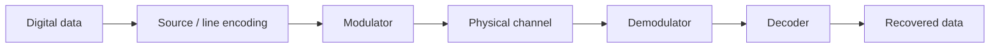

**Common digital modulation methods** - **ASK:** carrier amplitude
changes between symbols. - **FSK:** carrier frequency changes. -
**PSK:** carrier phase changes. - **QAM:** amplitude and phase both
change, enabling multiple bits per symbol.

**Why encoding matters:** it affects clock recovery, DC balance,
bandwidth, and error performance. For example, Manchester encoding has a
transition in every bit period for synchronization but requires more
bandwidth than simple NRZ in typical implementations.

**Why modulation matters:** it enables efficient transmission over
bandpass channels such as radio links and determines spectral
efficiency, robustness, and receiver complexity.

## Q13. Multiplexing and TDM

**Multiplexing** combines multiple independent data streams for
transmission over a shared physical channel. A multiplexer combines
streams at the sender; a demultiplexer separates them at the receiver.

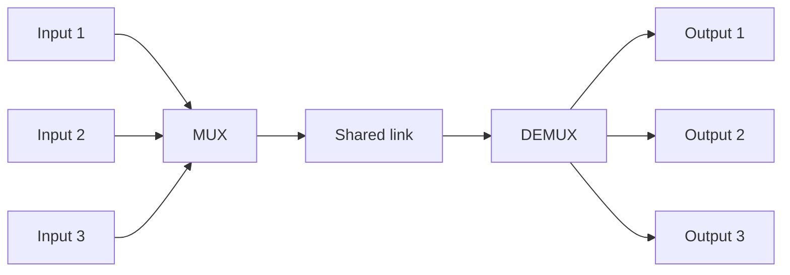

Other methods include Frequency Division Multiplexing (FDM), Wavelength
Division Multiplexing (WDM) in fibre, and Code Division Multiplexing
(CDM/CDMA).

### Time Division Multiplexing

TDM allocates transmission time to multiple sources. The link is divided
into time slots or frames.

**Synchronous TDM:** every input gets a fixed slot in each frame, even
if it has no data. It is simple and predictable but may waste capacity.

``` text
Frame n: | A | B | C | A | B | C | ...
          fixed repeating slots
```

**Statistical (asynchronous) TDM:** slots are assigned to active sources
only. Each transmitted unit typically carries an address/identifier so
the receiver knows which source it belongs to. It improves utilization
for bursty traffic but requires buffering, scheduling, and
identification overhead.

``` text
Synchronous:  | A | B | C | A | B | C |
Statistical:  | A | C | C | B | A | ... |  (active sources only)
```

  --------------------------------------------------------------------------
  Feature                 Synchronous TDM         Statistical TDM
  ----------------------- ----------------------- --------------------------
  Slot assignment         Fixed                   Dynamic to active inputs

  Empty input slot        May be wasted           Usually reassigned

  Delay                   Predictable             Can vary due to queueing

  Overhead                Low                     Requires
                          source-identification   identification/buffering
                          overhead                

  Best fit                Constant-rate traffic   Bursty data traffic
  --------------------------------------------------------------------------

## Q14. Switching techniques

Switching connects a source to a destination through intermediate
network nodes.

### Circuit switching

A dedicated path and resources are established before data transfer. The
path remains allocated for the session. Example: traditional telephone
networks.

-   Pros: predictable bandwidth and delay after setup.
-   Cons: setup delay and wasted capacity during silence.

### Packet switching

Data is divided into packets that share network links.

-   **Datagram:** each packet is routed independently and may take a
    different path; example, IP.
-   **Virtual circuit:** a logical route is set up and packets follow
    it.

Pros include efficient statistical sharing and resilience. Cons include
variable delay, congestion, and packet loss/reordering in some designs.

### Message switching

The entire message is stored and forwarded at each intermediate node. It
does not need a dedicated circuit, but requires storage and can cause
high delay. It is mainly of historical importance.

  -------------------------------------------------------------------------
  Technique         Resource          Delay             Typical use
                    allocation                          
  ----------------- ----------------- ----------------- -------------------
  Circuit           Reserved path     Setup then        Traditional voice
                                      predictable       

  Packet            Shared links per  Variable          Internet
                    packet                              

  Message           Whole message     Often high        Historical
                    stored and                          store-and-forward
                    forwarded                           systems
  -------------------------------------------------------------------------

**Efficient utilization:** packet switching statistically shares
bandwidth among users, while circuit switching is useful when
guaranteed, continuous resources are needed.

## Q15. Transmission impairments and noise

Three common transmission impairments are **attenuation, distortion, and
noise**.

1.  **Attenuation:** signal strength decreases with distance.
    Amplifiers/repeaters or optical amplifiers may compensate, but
    amplification also amplifies noise in many systems. Attenuation is
    often measured in decibels.
2.  **Distortion:** the received signal shape changes because frequency
    components experience different attenuation or delay. Equalization
    and proper bandwidth design help reduce it.
3.  **Noise:** unwanted energy is added to the signal, making recovery
    harder.

**Types of noise** - **Thermal noise:** random electron motion; present
in electronic components. - **Induced/electromagnetic noise:**
interference from motors, power lines, and other equipment. -
**Crosstalk:** energy from one communication channel leaks into
another. - **Impulse noise:** short, high-amplitude disturbances, such
as switching transients. - **Intermodulation noise:** nonlinear devices
create unwanted sum/difference frequencies. - **Quantization noise:**
error introduced when an analogue value is represented at finite digital
precision.

**Effects and mitigation:** impairments raise the error rate and limit
range/rate. Use shielding, grounding, twisted pairs, fibre, filtering,
equalization, repeaters, error-control coding, and appropriate transmit
power.

## Q16. Bit stuffing and byte stuffing

**Framing** identifies where one data-link frame starts and ends.

### Bit stuffing

A bit-oriented protocol uses a special flag, commonly `01111110`. To
prevent the same pattern from appearing in payload data, the sender
inserts a `0` after every sequence of five consecutive `1`s. The
receiver removes the inserted zero.

Example payload: `01111110` contains six consecutive ones. After
stuffing, it becomes `011111010` (the inserted zero breaks the run of
six ones). The exact stuffed result depends on the complete bit stream
and flag convention.

### Byte (character) stuffing

A character-oriented protocol uses special flag bytes. If a flag or
escape byte occurs in the payload, the sender inserts an escape byte
before it. The receiver removes the escape byte and treats the following
byte as data.

``` text
Byte stuffing:
Payload contains [FLAG]
Sender sends:    [ESC][FLAG]
Receiver removes ESC and restores the original payload byte.
```

  -----------------------------------------------------------------------
  Bit stuffing                        Byte stuffing
  ----------------------------------- -----------------------------------
  Operates on bits                    Operates on bytes/characters

  Useful for bit-oriented framing     Useful for byte-oriented protocols
  such as HDLC-style flags            

  Independent of character encoding   Depends on reserved byte values

  Adds bits only when needed          Adds escape bytes when reserved
                                      bytes appear
  -----------------------------------------------------------------------

**Which is better?** Neither is universally better. Bit stuffing suits
bit-oriented protocols and works independently of byte boundaries; byte
stuffing is convenient when framing is byte-oriented. The choice follows
the protocol design and payload format.

## Q17. CSMA protocols: persistent vs non-persistent

**Carrier Sense Multiple Access (CSMA)** is a contention-based MAC
method. A station senses the channel before transmitting. If the channel
is idle, it transmits according to its persistence rule; if busy, it
waits. Collisions can still occur because propagation delay means two
stations may sense idle simultaneously.

-   **1-persistent CSMA:** transmit immediately when the channel becomes
    idle; high chance of collision when several stations are waiting.
-   **Non-persistent CSMA:** if busy, wait a random time before sensing
    again; fewer repeated collisions but potentially more delay.
-   **p-persistent CSMA:** in slotted channels, transmit in an idle slot
    with probability (p), otherwise defer according to the protocol.

  -----------------------------------------------------------------------
  Criterion               1-persistent            Non-persistent
  ----------------------- ----------------------- -----------------------
  If channel busy         Continuously sense      Wait random backoff,
                                                  then sense

  Collision likelihood    Higher                  Usually lower
  under heavy load                                

  Delay                   Often low at light load Can be higher

  Channel utilization     Can fall under heavy    Backoff can reduce
                          contention              collisions but may
                                                  leave idle gaps

  Complexity              Simple                  Requires backoff policy
  -----------------------------------------------------------------------

CSMA/CD adds collision detection and is associated with traditional
shared, half-duplex Ethernet. Modern switched full-duplex Ethernet
generally avoids collisions. Wi-Fi uses CSMA/CA because a wireless
station cannot reliably detect every collision while transmitting.

## Q18. Nyquist maximum bit rate

For a noiseless channel, Nyquist gives:

\[ C = 2B`\log`{=tex}\_2 L \]

where (B) is bandwidth in Hz and (L) is the number of discrete signal
levels.

Given (B=5000`\text{ Hz}`{=tex}), (L=2):

\[ C=2(5000)`\log`{=tex}\_2 2=10000(1)=10000`\text{ bit/s}`{=tex} \]

**Answer: (10{,}000`\text{ bps}`{=tex}=10`\text{ kbps}`{=tex}).**

## Q19. Nyquist: required signal levels

Given (B=5`\text{ kHz}`{=tex}=5000`\text{ Hz}`{=tex}),
(C=90`\text{ kbps}`{=tex}=90000`\text{ bps}`{=tex}).

\[ C=2B`\log`{=tex}\_2 L \] \[ `\log`{=tex}\_2
L=`\frac{C}{2B}`{=tex}=`\frac{90000}{10000}`{=tex}=9 \] \[ L=2\^9=512 \]

**Answer: 512 signal levels**, assuming the ideal noiseless Nyquist
model. This is a mathematical result; practical systems may need a
different design because noise and hardware constraints matter.

## Q20. Nyquist: required bandwidth

Given (C=96{,}000`\text{ bps}`{=tex}), (L=4).

\[ C=2B`\log`{=tex}\_2 L `\quad`{=tex}`\Rightarrow`{=tex}`\quad`{=tex}
B=`\frac{C}{2\log_2 L}`{=tex} \] \[ B=`\frac{96000}{2\log_2 4}`{=tex}
=`\frac{96000}{2(2)}`{=tex} =24000`\text{ Hz}`{=tex} \]

**Answer: (24`\text{ kHz}`{=tex}).**

## Q21. Shannon capacity calculation

Given (B=4`\text{ kHz}`{=tex}=4000`\text{ Hz}`{=tex}),
(`\mathrm{SNR}`{=tex}\_{dB}=30`\text{ dB}`{=tex}).

Convert dB to linear SNR:

\[ 30=10`\log`{=tex}\_{10}(S/N) `\Rightarrow `{=tex}S/N=10\^{30/10}=1000
\]

Apply Shannon's theorem:

\[ C=B`\log`{=tex}\_2(1+S/N) =4000`\log`{=tex}\_2(1001) \]

Since (`\log`{=tex}\_2(1001)`\approx9.967`{=tex}),

\[ C`\approx4000`{=tex}(9.967)`\approx39868`{=tex}`\text{ bps}`{=tex} \]

**Answer: approximately (39.9`\text{ kbps}`{=tex})** (about 39.9 kb/s).
Small rounding differences are acceptable.

## Q22. Line coding waveforms


Waveforms depend on the convention taught in class. The following uses
these conventions: - **Unipolar NRZ:** `1 = +V`, `0 = 0 V`, no return to
zero during the bit. - **Polar NRZ-L:** `1 = +V`, `0 = −V`. - **Polar
NRZ-I:** transition at the beginning of a bit for `1`; no transition for
`0`; initial level is Low (−V). - **RZ:** `1 = +V` for first half then
zero; `0 = −V` for first half then zero (polar RZ convention). -
**Manchester:** `1 = Low-to-High`, `0 = High-to-Low` at the middle of
each bit. - **Differential Manchester:** always transition in the
middle; `0` has a transition at the beginning, `1` has no transition at
the beginning. Initial level is Low.

A text waveform uses `H` for +V, `L` for −V, and `0` for zero. Each
bracket is one bit period; `H→L` or `L→H` marks a mid-bit transition.

### 1. Unipolar NRZ: `110110010`

``` text
Bits:      1  1  0  1  1  0  0  1  0
Level:     H  H  0  H  H  0  0  H  0
```

Draw each level as a constant horizontal segment across its full bit
period.

### 2. Polar NRZ-L: `101101010`

``` text
Bits:      1  0  1  1  0  1  0  1  0
Level:     H  L  H  H  L  H  L  H  L
```

### 3. Polar NRZ-I: `101101010`, initial Low

Rule: `1` causes a transition at the start of the bit; `0` keeps the
previous level.

``` text
Bits:      1  0  1  1  0  1  0  1  0
Level:     H  H  L  H  H  L  L  H  H
```

### 4. Polar RZ: `1011011010`

Each bit returns to zero halfway through the bit.

``` text
Bits:      1     0     1     1     0     1     1     0     1     0
Half 1:    H     L     H     H     L     H     H     L     H     L
Half 2:    0     0     0     0     0     0     0     0     0     0
```

### 5. Manchester: `101110010`

Convention: `1 = L→H`, `0 = H→L`.

``` text
Bits:      1     0     1     1     1     0     0     1     0
Half bits: L H | H L | L H | L H | L H | H L | H L | L H | H L
```

### 6. Differential Manchester: `101101010`, initial level Low

There is always a middle transition. With the convention above, `0`
transitions at the start; `1` does not.

``` text
Bits:      1       0       1       1       0       1       0       1       0
Half bits: L H  |  H L  |  L H  |  H L  |  L H  |  H L  |  L H  |  H L  |  L H
```

**Exam tip:** Always write the convention before drawing the waveform.
Some textbooks reverse the `1`/`0` mapping, so a waveform can look
different while following a different stated convention.

------------------------------------------------------------------------

# Unit 2: Data Link Layer

## Q1. Character stuffing

Character-oriented framing marks the start and end of a frame using
special bytes called **flag bytes**. If a flag byte appears in the
payload, the sender inserts an **escape byte (ESC)** before it so the
receiver does not mistake payload for a frame boundary.

``` text
Frame: [FLAG] [payload bytes ...] [FLAG]
Payload contains FLAG:
Sender transmits: [FLAG] data [ESC][FLAG] data [FLAG]
Receiver: removes ESC and treats the following FLAG as payload.
```

**Working:** (1) sender scans payload bytes; (2) inserts ESC before
reserved flag/escape bytes; (3) receiver detects outer frame flags; (4)
within the frame, it removes the escape markers and restores the
original data.

**Advantages:** easy to implement for byte-oriented protocols and
preserves arbitrary payload bytes. **Limitations:** overhead depends on
the number of reserved bytes; both ends must agree on escape rules. It
differs from bit stuffing because it operates on bytes rather than
individual bits.

## Q2. Bit stuffing

Bit stuffing is used in bit-oriented framing to ensure that payload bits
cannot accidentally imitate a special flag pattern.

For the common HDLC flag `01111110`, the sender inserts a `0` after
every five consecutive `1`s in the payload. The receiver removes a `0`
that follows five consecutive payload `1`s.

Example:

``` text
Payload fragment before:  01111110
After stuffing:           011111010
```

The inserted zero prevents a run of six ones from forming inside the
data. (For a full frame, apply the rule across the entire payload, not
to the frame flags.)

**Steps:** scan bits, count consecutive ones, insert zero after five
ones, transmit the frame; at the receiver, detect flags, remove stuffed
zeros, and recover the original payload.

**Advantages:** works at bit level, is independent of character
encoding, and allows transparent payload contents. **Limitation:** adds
variable overhead and requires bit-level processing.

## Q3. VRC and LRC

### Vertical Redundancy Check (VRC)

VRC adds one parity bit to each data unit. With **even parity**, the
total number of `1`s including the parity bit must be even. With odd
parity, it must be odd.

Example: data `1011001` contains four ones, already even, so even-parity
bit = `0`. If data `1011000` contains three ones, even-parity bit = `1`.

At the receiver, parity is recalculated. A mismatch indicates an error
in that row. VRC detects all odd-numbered bit flips in a protected word
but can miss an even number of flips.

### Longitudinal Redundancy Check (LRC)

LRC arranges multiple data units as rows and computes parity
column-wise, creating an extra parity row. For even parity, each LRC bit
makes the number of ones in its column even.

Example:

``` text
Data rows:  1 0 1 1
            1 1 0 1
            0 1 1 0
LRC row:    0 0 0 0   (column parities: col1 has 2 ones, col2 has 2, col3 has 2, col4 has 2)
```

The receiver recomputes column parity. A mismatch indicates corruption.
LRC can detect many burst errors better than VRC alone, but some
patterns of errors can cancel out.

  -----------------------------------------------------------------------
  Feature                 VRC                     LRC
  ----------------------- ----------------------- -----------------------
  Parity applied          Per row/character       Per column across a
                                                  block

  Overhead                One parity bit per row  One parity row per
                                                  block

  Strength                Good for odd number of  Detects many multi-bit
                          bit errors per row      and burst patterns

  Limitation              Can miss even bit flips Some rectangular/even
                          in a row                patterns can escape
                                                  detection
  -----------------------------------------------------------------------

## Q4. VRC table: demonstrate errors

Assume each listed byte includes the parity bit at the end and uses
**even parity**. Count ones in each received byte.

    Row Sender       Receiver       Ones in received byte Result
  ----- ------------ ------------ ----------------------- --------------------
      1 `10111010`   `10111011`                         6 Even parity passes
      2 `11111010`   `11011010`                         4 Even parity passes
      3 `11001010`   `11101011`                         6 Even parity passes
      4 `01001010`   `01001010`                         3 Odd parity fails

**Important:** These outcomes show why a VRC check must use the actual
parity convention and correctly transcribed bytes. The table as supplied
appears inconsistent with the instruction "demonstrate that an error has
occurred": some receiver bytes have even parity despite differing from
the sender. VRC alone cannot compare against the sender's original byte;
it checks parity at the receiver. If the intended parity bit or bit
strings differ from the transcription, correct the table before
submitting. Under even parity, only row 4 fails the parity test as
transcribed.

## Q5. LRC table method

To solve each group: 1. Write all received data words as rows with bits
aligned in columns. 2. Calculate each column's parity (XOR all bits in
the column for even parity). 3. Compare the calculated LRC row with the
transmitted LRC row, if it is included. 4. Any column mismatch indicates
an error affecting that column; row parity can help localize the
affected byte if row parity is also available.

**Worked mini-example**

``` text
Received data:   1 0 1 1
                 1 0 1 0
                 1 1 0 1
Column XOR:      1 1 0 0
```

The LRC row is `1100` for even parity, because each LRC bit is the XOR
of the corresponding column bits. If the receiver recomputes a different
LRC row from the one sent, an error is detected.

**Source caution:** The original question's LRC table is malformed in
the supplied document and does not clearly label the LRC parity row. The
row groupings above are a cleaned transcription, not a guaranteed
reconstruction of the intended exam layout. Explain the algorithm and
verify the original table before reporting a unique numeric result.

## Q6. Hamming code: error detection and correction

Hamming code is a linear error-control code that inserts parity bits at
positions that are powers of two: 1, 2, 4, 8, and so on. Each parity bit
checks selected positions. The pattern of failed checks forms a
**syndrome**, which identifies a single-bit error position.

For (m) data bits, choose (r) parity bits such that:

\[ 2\^r `\ge `{=tex}m+r+1 \]

For 4 data bits, (r=3), because (2\^3=8`\ge4`{=tex}+3+1). Place parity
bits at positions 1, 2, and 4; data bits occupy 3, 5, 6, and 7.

**Even-parity example with data `1011`:** number positions from left to
right as 1 through 7, with parity at 1, 2, 4. Fill:

``` text
Position:  1 2 3 4 5 6 7
Content:   P1 P2 1 P4 0 1 1
```

-   (P_1) checks positions 1,3,5,7:
    (P_1`\oplus1`{=tex}`\oplus0`{=tex}`\oplus1`{=tex}=0), so (P_1=0).
-   (P_2) checks 2,3,6,7:
    (P_2`\oplus1`{=tex}`\oplus1`{=tex}`\oplus1`{=tex}=0), so (P_2=1).
-   (P_4) checks 4,5,6,7:
    (P_4`\oplus0`{=tex}`\oplus1`{=tex}`\oplus1`{=tex}=0), so (P_4=0).

Codeword: **`0110011`**.

At the receiver, recalculate parity checks (s_1,s_2,s_4). The binary
syndrome (s_4s_2s_1) gives the erroneous position. Flip that bit to
correct a single-bit error. Standard Hamming code corrects one-bit
errors; extended Hamming code adds an overall parity bit to support
single-error correction and double-error detection (SECDED).

## Q7. Hamming code for `1010010101`

There are (m=10) data bits. Find (r) such that
(2\^r`\ge `{=tex}m+r+1): - (r=4): (16`\ge10`{=tex}+4+1=15), so four
parity bits are enough. - Parity positions: 1, 2, 4, 8. - Data
positions: 3, 5, 6, 7, 9, 10, 11, 12, 13, 14.

Using positions numbered from the left and even parity, place data
`1010010101` in order:

  --------------------------------------------------------------------------------
  Position      1    2    3    4    5    6    7    8    9   10   11   12   13   14
  ---------- ---- ---- ---- ---- ---- ---- ---- ---- ---- ---- ---- ---- ---- ----
  Bit          P1   P2    1   P4    0    1    0   P8    0    1    0    1    0    1

  --------------------------------------------------------------------------------

Compute each parity over positions whose binary index contains that
parity bit: - (P_1): positions 1,3,5,7,9,11,13. Data ones at 3 only?
Bits are 1,0,0,0,0,0, so count = 1; set (P_1=1). - (P_2): positions
2,3,6,7,10,11,14. Data bits = 1,1,0,1,0,1; count = 4 (even); set
(P_2=0). - (P_4): positions 4,5,6,7,12,13,14. Data bits = 0,1,1,0,1,1;
count = 4 (even); set (P_4=0). - (P_8): positions 8,9,10,11,12,13,14.
Data bits = 0,1,0,1,0,1; count = 3 (odd); set (P_8=1).

**Codeword:** `101001001010101`.

**Check:** This result follows the stated left-to-right numbering
convention. Some textbooks number positions from the rightmost bit; if
your course uses that convention, the written codeword order will
differ.

## Q8. Correct received Hamming codeword `01100101001011`

There are 14 bits, which matches a 10-data-bit Hamming code with four
parity bits. To avoid ambiguity, assume positions are numbered from the
**left**, 1 through 14, and even parity is used. Parity checks are: -
(s_1): positions 1,3,5,7,9,11,13 - (s_2): positions 2,3,6,7,10,11,14 -
(s_4): positions 4,5,6,7,12,13,14 - (s_8): positions 8,9,10,11,12,13,14

Received bits by position: `0 1 1 0 0 1 0 1 0 0 1 0 1 1`

Parity results: - (s_1): bits 1,3,5,7,9,11,13 = `0,1,0,0,0,1,1` → 3 ones
→ fail (1) - (s_2): bits 2,3,6,7,10,11,14 = `1,1,1,0,0,1,1` → 5 ones →
fail (1) - (s_4): bits 4,5,6,7,12,13,14 = `0,0,1,0,0,1,1` → 3 ones →
fail (1) - (s_8): bits 8,9,10,11,12,13,14 = `1,0,0,1,0,1,1` → 4 ones →
pass (0)

Syndrome (s_8s_4s_2s_1=0111_2=7). **Error at position 7.** Flip bit 7
from `0` to `1`.

Corrected codeword: **`01100111001011`**.

## Q9. Flow control and Stop-and-Wait ARQ

**Flow control** prevents a fast sender from overwhelming a slower
receiver's buffer. **ARQ (Automatic Repeat reQuest)** adds error
recovery using acknowledgements, timers, and retransmission.

**Stop-and-Wait ARQ operation** 1. Sender transmits one frame and starts
a timer. 2. Receiver checks the frame and, if valid, sends an ACK. 3.
Sender receives ACK and transmits the next frame. 4. If a frame or ACK
is lost/corrupted, the timer expires and sender retransmits. 5. Sequence
numbers (often 0 and 1) help the receiver recognize duplicates.

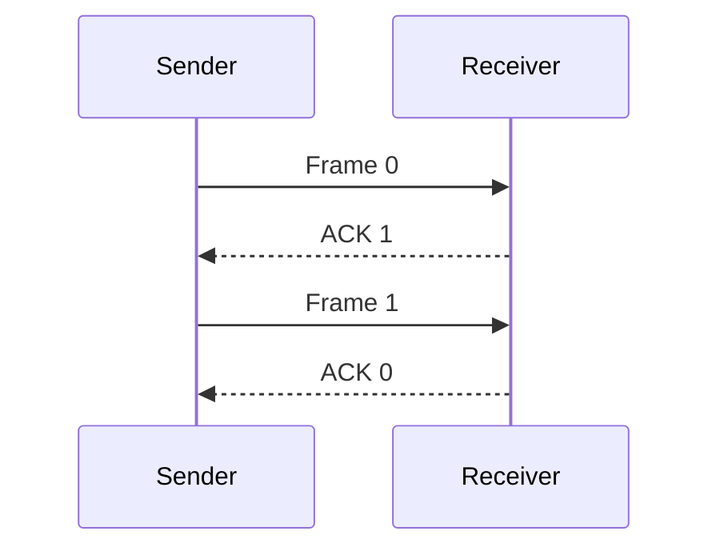

**Advantages:** simple, small buffer requirement, easy error recovery.
**Disadvantages:** poor link utilization on long-delay or high-speed
links because only one frame can be outstanding. If propagation delay is
large compared with frame transmission time, the sender spends much time
waiting.

## Q10. Sliding Window protocol

The Sliding Window protocol allows multiple frames to be outstanding
before acknowledgements arrive. The sender maintains a sending window;
the receiver maintains a receiving window. ACKs advance the window,
allowing new frames to be sent.

``` text
Sequence numbers: 0 1 2 3 4 5 6 7
Sender window:    [0 1 2 3] 4 5 6 7
After ACKs:         0 1 [2 3 4 5] 6 7
```

**Improvement over Stop-and-Wait:** while one frame is in transit, the
sender can transmit additional frames, so the link is better utilized.
Window size and sequence-number space must be chosen carefully to avoid
ambiguity.

Common sliding-window ARQ protocols: - **Go-Back-N:** receiver accepts
in-order frames; on an error, sender retransmits the missing frame and
subsequent outstanding frames. - **Selective-Repeat:** receiver can
buffer out-of-order frames and sender retransmits only missing/damaged
frames.

Benefits include higher throughput and pipelining. Costs include
sequence-number management, buffers, timers, and more complex recovery
logic.

## Q11. Go-Back-N ARQ

Go-Back-N is a sliding-window ARQ protocol in which the sender can send
multiple frames, but the receiver generally accepts only the next
expected frame in order. If a frame is lost or corrupted, later frames
may be discarded, and the sender retransmits from the missing frame
onward.

``` text
Sender:   F0 ----> F1 ----> F2 -X-> F3 ----> F4
Receiver: ACK1     ACK2     (F2 missing; F3/F4 discarded)
Sender:                  timeout / NAK
          retransmit F2 ----> F3 ----> F4
```

**Sequence space:** with (k)-bit sequence numbers, common Go-Back-N
designs allow sender window size at most (2\^k-1), preventing confusion
between old and new frames.

**Advantages:** simpler receiver; cumulative ACKs; efficient when errors
are rare. **Disadvantages:** a single loss can force retransmission of
several correctly sent later frames, wasting bandwidth on noisy links.

## Q12. Selective-Repeat ARQ

Selective-Repeat (also called Selective-Reject in some course material)
retransmits only frames that are lost or corrupted. The receiver can
buffer valid out-of-order frames and later deliver them in sequence once
the gap is filled.

``` text
Sender:   F0 ----> F1 ----> F2 -X-> F3 ----> F4
Receiver: ACK0     ACK1     missing  buffers F3, F4
Sender:                  retransmit only F2
Receiver: now delivers F2, F3, F4 in order
```

  -----------------------------------------------------------------------
  Feature                 Go-Back-N               Selective-Repeat
  ----------------------- ----------------------- -----------------------
  Receiver accepts        Usually no              Yes, buffers them
  out-of-order frames                             

  Retransmission          Missing frame and later Only missing/damaged
                          outstanding frames      frames

  Buffer need             Lower                   Higher

  Complexity              Lower                   Higher

  Efficiency on noisy     Can waste bandwidth     Usually better
  links                                           

  Sequence number rule    Window ≤ (2\^k-1)       Commonly window ≤
                                                  (2\^{k-1})
  -----------------------------------------------------------------------

Selective-Repeat is attractive when round-trip time is high and errors
occur, because it avoids unnecessary retransmissions. Its costs are more
memory, timers, and careful sequence-number/window management.

## Q13. HDLC frame structure and frame types


**HDLC (High-Level Data Link Control)** is a bit-oriented, synchronous
data-link protocol. It supports framing, flow control, and error
control.

``` text
+------+---------+---------+-------------+---------+------+
| Flag | Address | Control | Information |   FCS   | Flag |
+------+---------+---------+-------------+---------+------+
 8 bits  variable variable   variable      16/32 bits 8 bits
```

-   **Flag:** `01111110`, marks frame boundaries.
-   **Address:** identifies a secondary station or destination,
    depending on configuration.
-   **Control:** indicates frame type, sequence numbers,
    acknowledgements, and poll/final information.
-   **Information:** payload, present in information frames and some
    unnumbered frames.
-   **FCS:** Frame Check Sequence, usually CRC-based, detects
    transmission errors.
-   **Closing flag:** marks the end and can sometimes be shared with the
    next frame depending on implementation.

**Frame types** 1. **I-frame (Information):** carries user data and
sequence numbers. (N(S)) is the send sequence number; (N(R))
acknowledges the next expected frame in piggybacked acknowledgement. 2.
**S-frame (Supervisory):** manages flow/error control without user data.
Common functions include Receive Ready (RR), Receive Not Ready (RNR),
Reject (REJ), and Selective Reject (SREJ), depending on HDLC mode. 3.
**U-frame (Unnumbered):** link management, setup, disconnect, and other
control functions.

**Operation:** the sender frames data, calculates the FCS, and transmits
it. The receiver checks the FCS; valid frames are accepted and
acknowledged as appropriate, while damaged frames trigger retransmission
or recovery according to the mode. Bit stuffing prevents the flag
sequence from appearing in payload data.

## Q14. Fixed and dynamic channel allocation

**Channel allocation** decides how multiple stations share a common
communication medium.

### Fixed (static) allocation

A resource is permanently or periodically reserved for a station.
Examples include fixed TDMA slots or fixed frequency bands in FDM.

-   Advantages: predictable service, low contention, straightforward
    scheduling.
-   Disadvantages: unused allocations waste capacity when a station has
    no data; inflexible for bursty traffic.

### Dynamic allocation

Stations receive capacity when they need it, through contention or
scheduling. Examples include Ethernet contention in legacy shared
networks, Wi-Fi MAC contention, and demand-assigned scheduling.

-   Advantages: adapts to traffic and can improve utilization.
-   Disadvantages: coordination overhead, variable delay, and possible
    collisions or queueing.

  -----------------------------------------------------------------------
  Aspect                  Fixed                   Dynamic
  ----------------------- ----------------------- -----------------------
  Allocation              Preassigned             Demand-based

  Delay                   Predictable             Variable

  Idle station            May waste its           Capacity can be reused
                          allocation              

  Coordination            Lower during            More
                          transmission            signalling/contention

  Suitable traffic        Steady, predictable     Bursty, changing
  -----------------------------------------------------------------------

## Q15. MAC allocation, Pure ALOHA and Slotted ALOHA

The MAC sublayer decides which device may transmit on a shared medium.
The **channel-allocation problem** is how to divide finite capacity
fairly and efficiently while limiting collisions and delay.

### Static vs dynamic allocation

Static allocation gives each user a fixed share (e.g. fixed TDMA slot or
frequency band). Dynamic allocation gives capacity to active users
through contention or scheduling. Static methods provide predictability
but waste idle capacity; dynamic methods adapt better but require
coordination and collision recovery.

### Pure ALOHA

A station transmits whenever it has a frame. If an ACK is not received,
it waits a random backoff interval and retransmits. Any overlap with
another frame causes a collision.

-   Vulnerable period: (2T), where (T) is frame transmission time.
-   Throughput: (S=Ge\^{-2G}), where (G) is offered load in frame
    attempts per frame time.
-   Maximum theoretical throughput: (1/(2e)`\approx0.184`{=tex}), or
    **18.4%**.

### Slotted ALOHA

Time is divided into slots of one frame time; a station may transmit
only at a slot boundary. This reduces the vulnerable period to (T).

-   Throughput: (S=Ge\^{-G}).
-   Maximum theoretical throughput: (1/e`\approx0.368`{=tex}), or
    **36.8%**.

  ------------------------------------------------------------------------
  Feature                 Pure ALOHA               Slotted ALOHA
  ----------------------- ------------------------ -----------------------
  Transmission time       Any time                 Slot boundaries only

  Synchronization         Not required             Required

  Vulnerable period       (2T)                     \(T\)

  Maximum throughput      18.4%                    36.8%

  Collision recovery      Random                   Random slot
                          retransmission/backoff   retry/backoff
  ------------------------------------------------------------------------

Slotted ALOHA doubles the theoretical peak throughput by halving the
vulnerable period, but requires synchronization. Both perform poorly
under heavy load because collisions and retransmissions increase.

------------------------------------------------------------------------

# Additional Numerical Practice Problems

## P1 and P3. Hamming code for `1011`

Use Hamming ((7,4)), even parity, positions numbered from left to right,
parity bits at 1, 2, 4.

``` text
Position:  1 2 3 4 5 6 7
Content:   P1 P2 1 P4 0 1 1
```

-   (P_1) checks 1,3,5,7. The data bits are 1,0,1 (two ones), so
    (P_1=0).
-   (P_2) checks 2,3,6,7. The data bits are 1,1,1 (three ones), so
    (P_2=1).
-   (P_4) checks 4,5,6,7. The data bits are 0,1,1 (two ones), so
    (P_4=0).

**Final codeword: `0110011`.**

## P2. 1's-complement checksum

The supplied words are each **9 bits**, not 8: `110010100`, `101001010`,
`111100100`, `001101100`.

A checksum must use a consistent word size. Since the question
explicitly says 8-bit checksum, the data likely contains a transcription
error. Do not silently truncate or split the words: that changes the
answer. Confirm whether the intended words are 8 bits or whether a 9-bit
checksum is required.

**Method once the word size is confirmed** 1. Add words using
1's-complement addition. 2. Whenever a carry leaves the most significant
bit, wrap it around and add it to the least significant bit. 3. Invert
every bit of the final sum to obtain the checksum. 4. At the receiver,
add all data words and the checksum using the same end-around-carry
rule. An all-ones result indicates no checksum error was detected.

## P4. Hamming code `1011011`

Assume a 7-bit Hamming ((7,4)) code, positions numbered left to right,
and even parity. Received bits:

  Position     1   2   3   4   5   6   7
  ---------- --- --- --- --- --- --- ---
  Bit          1   0   1   1   0   1   1

Parity checks: - (s_1): positions 1,3,5,7 → `1,1,0,1` = 3 ones → fail
(1). - (s_2): positions 2,3,6,7 → `0,1,1,1` = 3 ones → fail (1). -
(s_4): positions 4,5,6,7 → `1,0,1,1` = 3 ones → fail (1).

Syndrome (s_4s_2s_1=111_2=7), so **position 7 is in error**. Flip bit 7
from 1 to 0.

Corrected codeword: **`1011010`**.

## P5--P6. CRC encoding and verification

A unique answer cannot be computed because the supplied question omits
the generator polynomial. CRC requires a specified generator bit pattern
(G(x)).

**Sender procedure** 1. Let the generator have degree (r). 2. Append (r)
zero bits to the dataword. 3. Divide the augmented data by the generator
using modulo-2 division (XOR, no carries or borrows). 4. Append the
(r)-bit remainder to the original dataword to form the codeword.

**Receiver procedure** 1. Divide the received codeword by the same
generator. 2. If the remainder is all zero, the frame passes the CRC
check; otherwise reject it. 3. A zero remainder does not mathematically
guarantee that no error occurred; it means no error pattern detectable
by that CRC was found.

Obtain the exact generator polynomial from the instructor before writing
the final bit-level division.

## P7. Checksum for `11001100`

The problem gives a single 8-bit message but does not specify the
checksum word size or how the message is segmented. If treated as one
8-bit word, its 1's-complement checksum is the bitwise complement:

``` text
Data:      11001100
Checksum:  00110011
```

At the receiver:

``` text
  11001100
+ 00110011
-----------
  11111111
```

The result is all ones, so the checksum check passes under this
one-word, 8-bit assumption. If the instructor intended multiple data
words, more data is needed.

## P8. VRC for `10101010`

The bit string has four ones, so under **even parity** the parity bit is
`0`. The transmitted 9-bit unit is `101010100`.

At the receiver, count all ones including the parity bit. If the total
is odd, parity fails and an error is detected. For example, if one data
bit flips and the received unit becomes `111010100`, the total number of
ones is five, so even parity fails.

VRC detects any odd number of bit flips within the protected unit, but
it can miss an even number of flips.

## P9. LRC for `10101010`

LRC needs a block layout, so the following uses two 4-bit rows and even
column parity:

``` text
Data row 1:  1 0 1 0
Data row 2:  1 0 1 0
             -------
LRC row:     0 0 0 0
```

Each column contains either two ones or zero ones, so each column
already has even parity. The LRC row is `0000`.

At the receiver, recompute the column parity. A mismatch between
calculated and transmitted LRC indicates an error. A different
segmentation (for example, one 8-bit row with one parity bit per column)
produces a different layout, so state the chosen matrix arrangement in
the answer.

## P10. VRC vs LRC effectiveness

  -----------------------------------------------------------------------
  Error pattern           VRC                     LRC
  ----------------------- ----------------------- -----------------------
  Single-bit error        Detects it in the       Usually detects it in
                          affected row            the affected column

  Odd number of flips in  Detects                 Often detects if column
  one row                                         parity is affected

  Even number of flips in May miss                May detect if affected
  one row                                         columns have odd parity

  Burst errors across     Limited                 Better for many
  rows/columns                                    patterns because it
                                                  checks columns

  Certain                 Can miss                Can also miss patterns
  balanced/multiple                               whose parity cancels
  errors                                          
  -----------------------------------------------------------------------

Two-dimensional parity (row parity plus column parity) can locate a
single-bit error at the intersection of the failed row and column.
Neither parity method can detect every possible multi-bit error.

## P11. Hamming code for `11100011`

There are (m=8) data bits. Choose (r) such that (2\^r`\ge `{=tex}m+r+1).
With (r=4), (16`\ge13`{=tex}), so four parity bits are enough. Use
positions 1--12 from left to right; parity positions are 1, 2, 4, 8.

Place data bits in positions 3,5,6,7,9,10,11,12:

  Position      1    2   3    4   5   6   7    8   9   10   11   12
  ---------- ---- ---- --- ---- --- --- --- ---- --- ---- ---- ----
  Content      P1   P2   1   P4   1   1   0   P8   0    0    1    1

Even parity: - (P_1) checks 1,3,5,7,9,11: data bits `1,1,0,0,1` contain
3 ones, so (P_1=1). - (P_2) checks 2,3,6,7,10,11: data bits `1,1,0,0,1`
contain 3 ones, so (P_2=1). - (P_4) checks 4,5,6,7,12: data bits
`1,1,0,1` contain 3 ones, so (P_4=1). - (P_8) checks 8,9,10,11,12: data
bits `0,0,1,1` contain 2 ones, so (P_8=0).

Codeword: **`111111000011`**.

To demonstrate correction, introduce a single-bit error in a copy of the
codeword, e.g. flip position 6. At the receiver, calculate parity checks
(s_1,s_2,s_4,s_8); the syndrome is binary position 6 (`0110` when
written (s_8s_4s_2s_1)). Flip bit 6 back. The corrected codeword is
`111111000011`.

------------------------------------------------------------------------

## How to write an 8--10 mark answer

For theory questions, aim for this order: 1. **Definition and purpose**
(1 mark). 2. **Principle / working steps** (2--3 marks). 3. **Neat
labelled diagram or comparison table** (2 marks). 4. **Types, examples,
advantages and limitations** (2--3 marks). 5. **Short conclusion or
application** (1 mark).

For numerical questions, show the formula, define symbols, substitute
values with units, show intermediate steps, state the final result
clearly, and mention any assumptions. A diagram without labels is mostly
decorative; label it.
